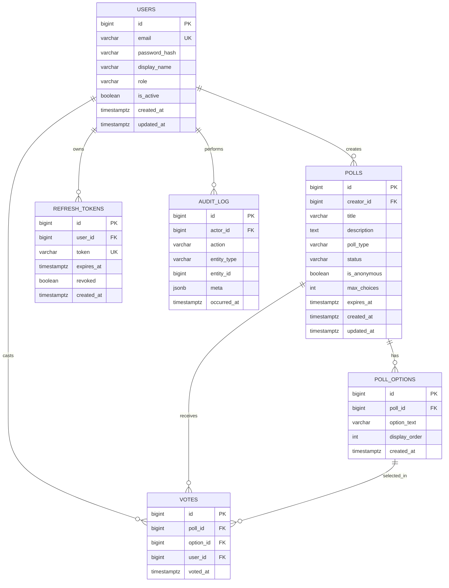

# Entity Relationship Diagram (ERD)

```mermaid
erDiagram
    USERS {
        bigint id PK
        varchar email UK
        varchar password_hash
        varchar display_name
        varchar role
        boolean is_active
        timestamptz created_at
        timestamptz updated_at
    }

    POLLS {
        bigint id PK
        bigint creator_id FK
        varchar title
        text description
        varchar poll_type
        varchar status
        boolean is_anonymous
        int max_choices
        timestamptz expires_at
        timestamptz created_at
        timestamptz updated_at
    }

    POLL_OPTIONS {
        bigint id PK
        bigint poll_id FK
        varchar option_text
        int display_order
        timestamptz created_at
    }

    VOTES {
        bigint id PK
        bigint poll_id FK
        bigint option_id FK
        bigint user_id FK
        timestamptz voted_at
    }

    REFRESH_TOKENS {
        bigint id PK
        bigint user_id FK
        varchar token UK
        timestamptz expires_at
        boolean revoked
        timestamptz created_at
    }

    AUDIT_LOG {
        bigint id PK
        bigint actor_id FK
        varchar action
        varchar entity_type
        bigint entity_id
        jsonb meta
        timestamptz occurred_at
    }

    USERS ||--o{ POLLS : creates
    USERS ||--o{ VOTES : casts
    USERS ||--o{ REFRESH_TOKENS : owns
    USERS ||--o{ AUDIT_LOG : performs
    POLLS ||--o{ POLL_OPTIONS : has
    POLLS ||--o{ VOTES : receives
    POLL_OPTIONS ||--o{ VOTES : selected_in
```
